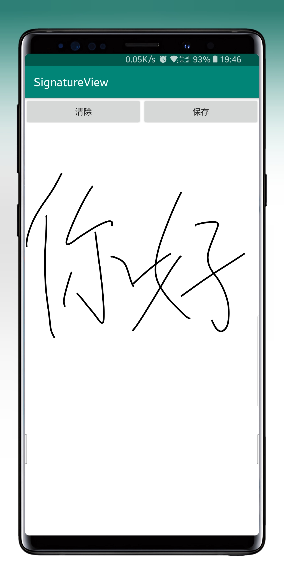

# SignatureView
[](https://jitpack.io/#F1ReKing/SignatureView)
[](https://github.com/F1ReKing/SignatureView/blob/master/LICENSE)   
<p>一个在 Android 上的签名板，能保存所签名的图片</p>
 
## 预览图

<a href="art/SignatureView.jpg"></a>

## 引入

#### Step 1. Add the JitPack repository to your build file
```
	allprojects {
		repositories {
			...
			maven { url "https://jitpack.io" }
		}
	}
```

#### Step 2. Add the dependency
```
	dependencies {
	       compile 'com.github.F1ReKing:SignatureView:1.1.0'
	}
```
## 使用
```
<com.f1reking.signatureview.SignatureView
    android:layout_width="match_parent"
    android:layout_height="match_parent"
    app:penColor="@color/colorPrimary"
    app:penWidth="30"
    app:backColor="@color/colorPrimary"
        />
```
### 属性：

| 属性名             | 字段        | 描述              | 默认值       |
| --------------- | --------- | --------------- | --------- |
| penColor | color   | 画笔颜色 | 0xFF000000         |
| backColor       | color | 背板颜色            |   0xFFFFFFFF    |
| penWidth       | int     | 画笔大小            | 10 |

### api:
| 方法             | 描述        | 参数说明              |
| --------------- | --------- | --------------- |
| void clear() | 清空签名   |  | 
| void save(String path, boolean clearBlank, int blank) | 保存图片 | path：保存的地址；clearBlank：是否清除空白区域；blank：空白区域留空距离；           |  
| void getSavePath()       | 获取保存路径     |             | 

## License

```
Copyright 2018 F1ReKing. 

Licensed under the Apache License, Version 2.0 (the "License");
you may not use this file except in compliance with the License.
You may obtain a copy of the License at

   http://www.apache.org/licenses/LICENSE-2.0

Unless required by applicable law or agreed to in writing, software
distributed under the License is distributed on an "AS IS" BASIS,
WITHOUT WARRANTIES OR CONDITIONS OF ANY KIND, either express or implied.
See the License for the specific language governing permissions and
limitations under the License.
```
